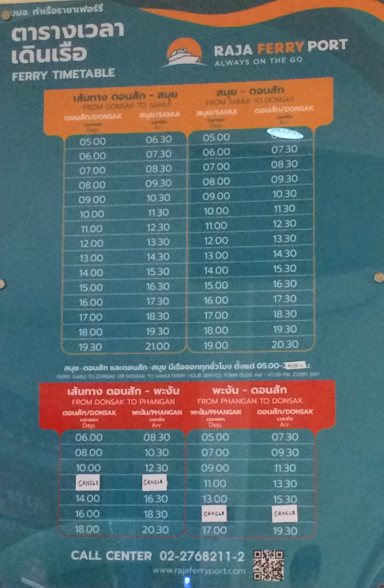
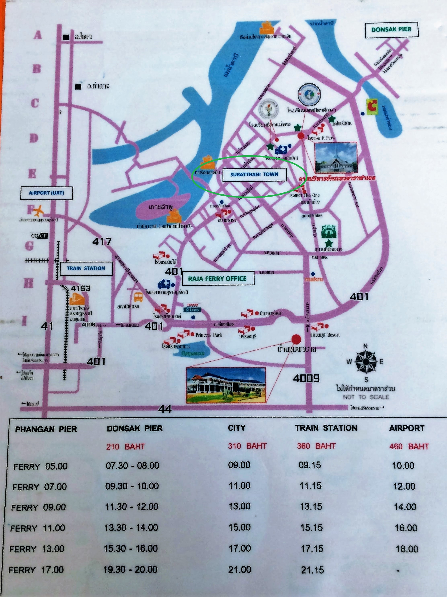

During our travel through Thailand, as many other backpackers, we did not have the exact plan, but just several pins on the map with places we wished to visit. A party island **Ko Phangan** was one of them. We got there by plane. There is an easy connection from Bangkok to Surat Thani. At arrival, we bought a combined ticket _Surat Thani airport - bus to Donsak ferry - ferry to Ko Phangan_. 

After spending 3 days on the island, we decided to move forward. The next destination on our map was  **Railay Beach, Krabi**. When it was time to pack our backpacks, we were super **stressed**. Why?.. because of an upcoming journey. We checked many posts and saw so much complaining, confusion and negative experience. People got ripped off by local bus drivers, were dropped off at a wrong place, had to wait 2-3 hours in the middle of nowhere, etc. etc... Well, guess what, we were worried a lot about how we can make our way.

Small spoiler - in the end, it did work out well! And I'd like to share my experience in this blog post to clear up all confusion.

First of all, I'd like to highlight, that we were doing a **budget travel**. We tried to use as much public transport as we could, without taking a taxi and tourist buses if we could avoid them. Of course, if you go to the closest travel agency, you can get anywhere in Thailand. They will organize a transfer for you from door to door. Just keep in mind, that it will hit your pocket and Thailand won't look that cheap anymore. 😉

Well, if you prefer a budget travel as we do, keep on reading. Moving from Ko Phangan to Railay Beach will take you **4 easy steps**.

## Step 1. Ko Phangan to Surat Thani (310 Baht)

The best way to get from Ko Phangan to Surat Thani is to buy a combined ticket bus+ferry at the Thong Sala Pier: **Ko Phangan - Surat Thani city** (important to say CITY, as they also offer transfer to the train station and to the airport). This cost us 310 Baht per person and included a ferry from Ko Phangan to Donsak Pier with a later transfer to a minivan, which took us to Surat Thani city center. 

I have to admit, that this part was the most stressful for us. We read a lot, that bus drivers drop off people in some other part of the city or even in the middle of the highway. Well, we asked a driver about 10 times "Surat Thani city, city, CITY!!" I'm pretty much sure, that he understood us from the first time 🙂 and he delivered us perfectly in the city center. 

Small remark - it seems, that there is no other public transport connection between Surat Thani and Donsak Pier, even locals take such minivans. You shouldn't be afraid of that.

## Step 2. Surat Thani - Krabi city (170 baht)

When we arrived at Surat Thani bus station, they dropped us off in front of a tourist office, where they asked us where we are going and offered to use their service. We just politely said no and walked to a bus station. The bus station is located **10 min by foot** from the place, where they dropped us off.

Bus station address: _Khanom Bus Station, Talad Mai 31 Alley, Tambon Talat, Amphoe Mueang Surat Thani, Chang Wat Surat Thani 84000, Thailand_

At the bus station, we looked for a minivan (seems it's the official transport) with a big sign along the car **Surat Thani - Krabi**. We asked the driver about the price and time - it costs **170 Baht** per person and it departures when it gets full. Simple as it is. 

Do not worry about departure time, buses go approximately every 10-20 min. All local buses which we took in Thailand have this _schedule_ - they start off when they get full.

And again - locals use these buses.  

## Step 3. Krabi - Ao Nang (60 Baht)

In Krabi we were dropped off at a bus station a bit outside the city. Local people advised us to go to another bus station, which has more connections. It was just a 10 minutes walk. There we took a local **songthaew** taxi (tuk-tuk) with **Ao Nang** written on it. You won't miss them - they are big, shiny and noisy. We paid **60 Baht** per person.

## Step 4. Ao Nang - Railay beach (150 Baht)

The last part of the journey was the easiest one - there are hundreds of boats which deliver people to different beaches and islands from Ao Nang. They have **fixed rates**, check it at the information stand next to the beach. It cost us **150 Baht** per person to get to Railay beach.

## Summary

My experience:

* **Total expenses:** 310 + 170 + 60 + 150 = 690 Baht per person to get from Ko Phangan to Railay Beach. 
* **Time:** we took a ferry at 8 a.m. and were at Railay beach after 8 p.m. Basically the whole day we spent in transport.

In the end, I would really like to break the stereotypes about locals trying to scam tourists! Don't be so distrustful when you take local transport or talk to local people. We have noticed, that Thai people **keep their word**. If they said, that they will drop you off at a certain place or pick you up at a certain time, they will do it. Every time they were punctual, friendly and ready to help.

I know, that scam happens, but probably mostly to the type of tourists, who switch off their brain when they arrive in Asia and rely only on their travel agency.  If you are a bit **more open** to the people, culture and informed about the country, you will find Thailand a great place to travel and Thai people the nicest people ever!

---
It took us much time to make a research regarding this connection, find locations of bus stations and put all the dots together. I hope this post will help you to plan your travel better and motivate you to use public transport in Thailand. It gives THE WAY MORE local experience, which you will never see on a bus, full of tourists. I personally just loooove traveling this way and encourage you to be open to it!

Share your experience with Thai public transport in comments or drop me an email at marimatush@gmail.com. Save travel everyone! :heart: