This is my first attempt at writing a climbing gym review. Berta Block is a symbolic place to me - I have started bouldering at that gym. I love this place because of its style and varieties of bouldering problems.

Together with a huge amount of boulders, Berta Block offers technical courses for kids and adults, birthday parties (for kids 😊) and yoga classes. See details on the official [Berta Block website](http://www.bertablock.de/).

The gym is located in the north part of Berlin in the Pankow district. It is pretty easy to get there by public transport, you go by **S-Bahn S2, S8, S9** or **U-Bahn U2** to the station **S+U Pankow** and from there 10 more minutes walk.

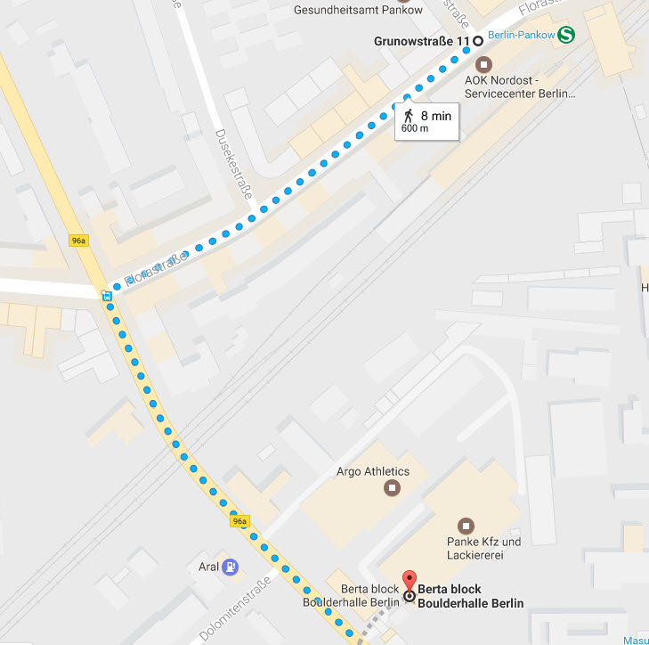

In the check-in area you can rent climbing shoes and a chalk bag for a small price. You can also get a key to a locker, but you will need to leave your ID, an insurance card or a driving license as a deposit.

**Berta Block is always busy!** If you come early in the morning or late in the evening - there will be already people climbing there. The gym can be very crowded especially on working days after 6 pm and especially in winter time. I personally don’t like it - you need to stand in a queue at the entrance to check in. You might also have troubles to get a key for a locker in very busy days. And in the end you need literally to search for a problem which is not occupied.. In winter time I prefer to go to Berta Block on weekends.

The gym was freshly renovated in 2017 and changing rooms are clean with comfortable showers.

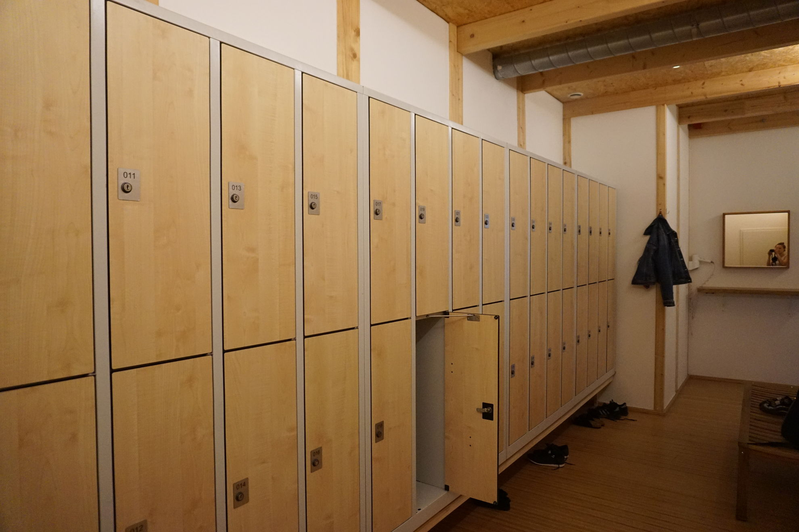

If you feel like go climbing but don’t have friends around - it's totally not a problem, you can always join a meetup group which has weekly meetups in Berta Block, just follow this link for details: [Meetup group at Berta Block](https://www.meetup.com/Berlin-Rock-Climbing-and-Bouldering-Meetup/events/239007937/)

## Climbing area

Climbing area in Berta Block is huge! The gym has **3 rooms** with the total area of **1500 sq.m.** Climbing walls are about **4.2m - 4.5m** high. The walls organized very nicely, I think everyone can find a problem for his or her taste - either you want to do some powerful moves on overhanging walls or solve a static problem which requires some flexibility.

I guess my favorite room is the last one. I love that it has really long overhanging problems. I like to go there and try some problems at the end of my training to get completely pumped and tired, it gives me a nice ‘Ok, I’m done for today..’ feeling 💪

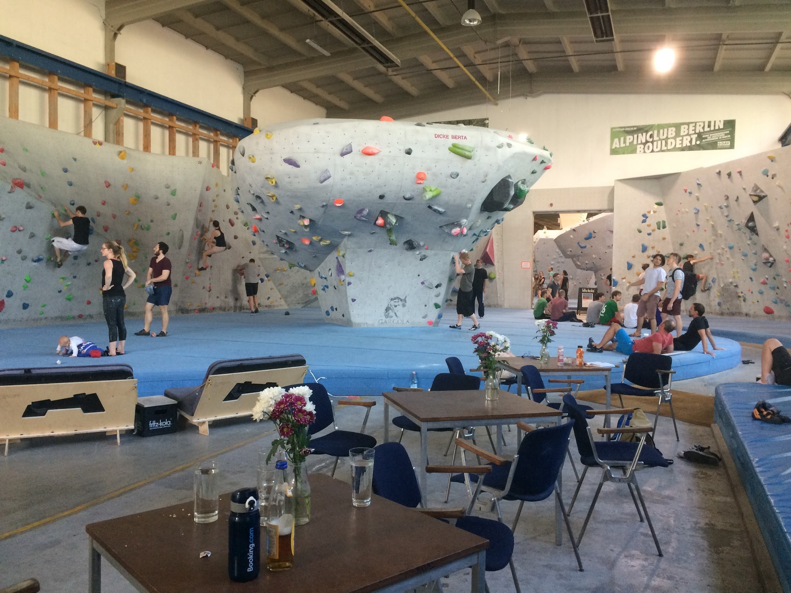

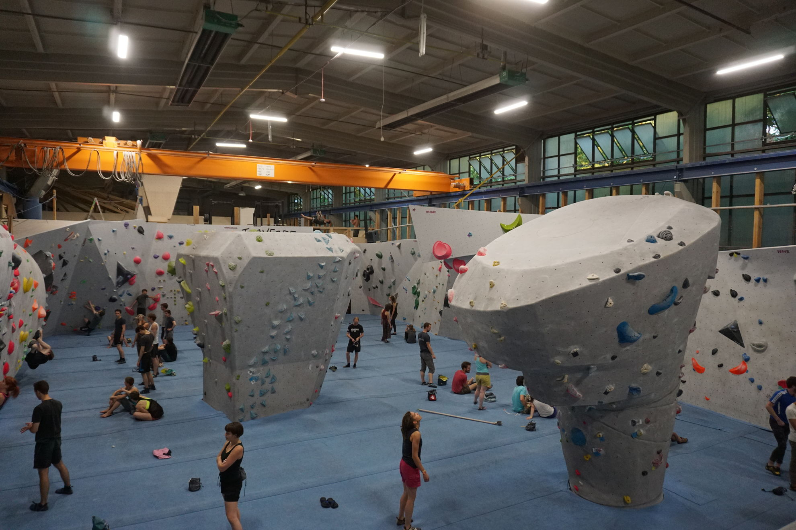

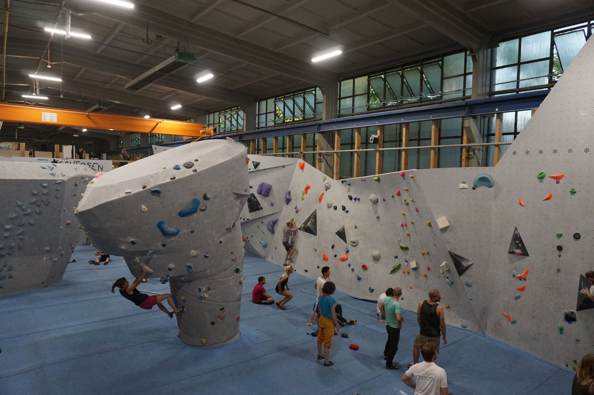

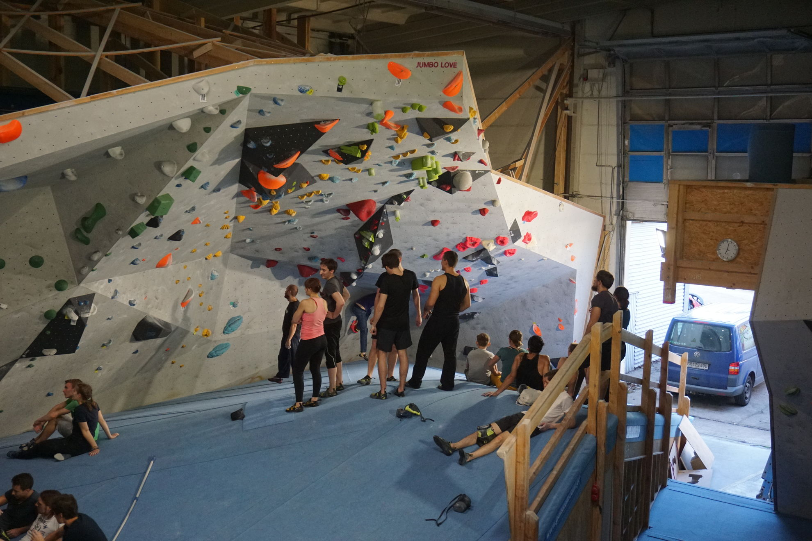

What makes Berta Block special to me is climbing blocks **“Boulderpilz"**. The direct translation from German is “climbing mushroom”. What is it? Basically, it is a 360 degrees climbing block which you can climb out. It gives you a little bit of summit experience. Each ‘mushroom’ is about 5m high and there is 4 of them in the gym - one in the first room and three in the second room. Usually you can find problems with the different level of complexity on each of them, so you can try it out independent on your skills! It’s quite a nice feeling to climb it out and stand on top of it.

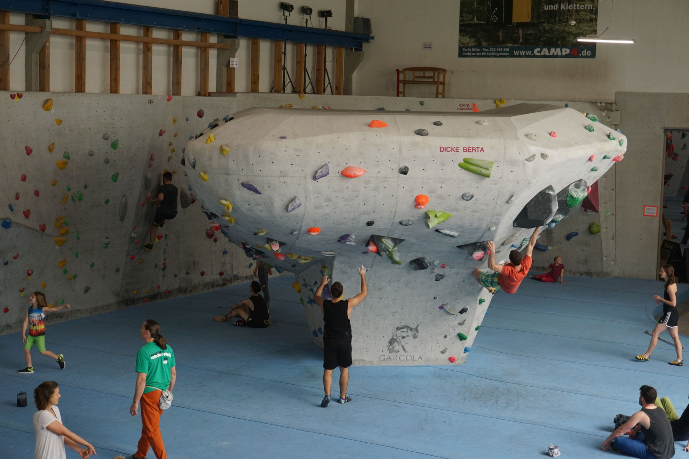

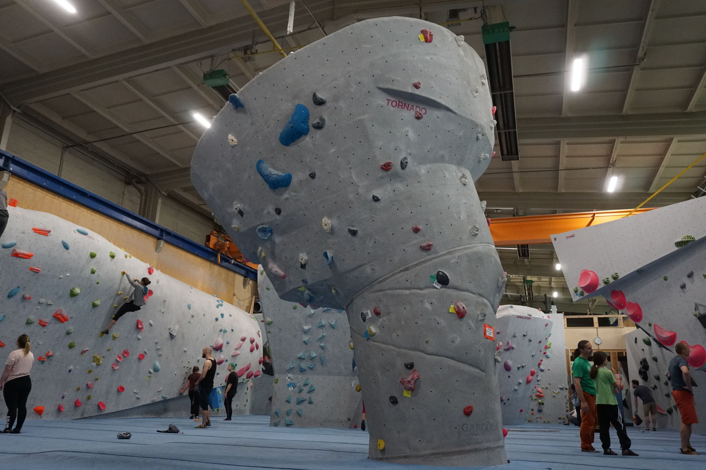

## Bouldering Grades

They used to have numeric French grade system, but it was recently updated to a color system:

- white color - 2 to 5a
- yellow color - 5a to 5c
- green color - 5c to 6b
- blue color - 6b to 6c+
- purple color - 6c+ to 7a+
- black color - 7A+ and higher

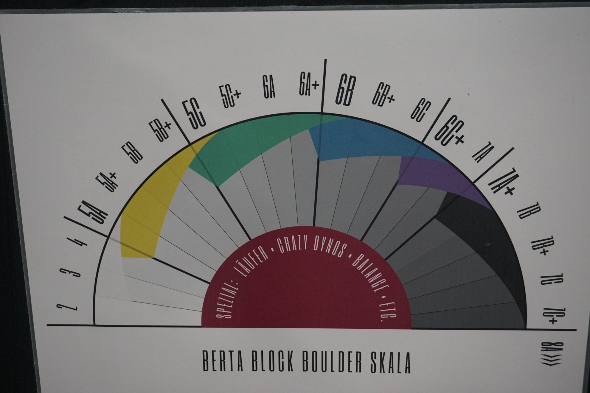

## Training

In fact there are 2 training areas in the gym, both are located on the upper level. I like this idea that you can warm up and watch the whole room from above, it gives me motivation.

The training area was renovated in 2017 and now offers several machines, a big campus board, gymnastic rings and of course some area for yoga and stretching. What I’m missing a bit is a warm-up bouldering wall, they had it before and it was removed during the renovation. But maybe it will be back one day.

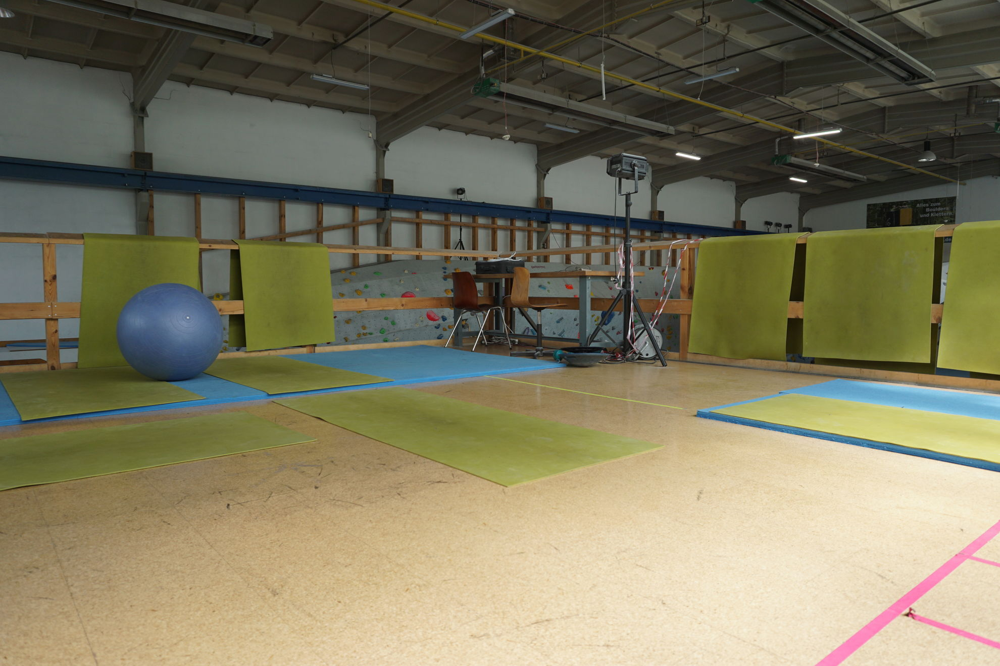

## Entertainment

The atmosphere in the gym is always nice and friendly, you can enjoy staying there even when you are not climbing. The gym has quite a big chilling lounge with chairs and couches, quite often it’s full of parents who are waiting for their kids.

The bar offers different snacks, such as fruits, cakes, sandwiches. Nothing special, but it’s always nice to relax a little bit with a cup of coffee and a piece of cake.

And of course they serve beer, otherwise it wouldn’t be Berlin 🍺😊 Many people relaxing after training and chat with their friends with a glass of beer.

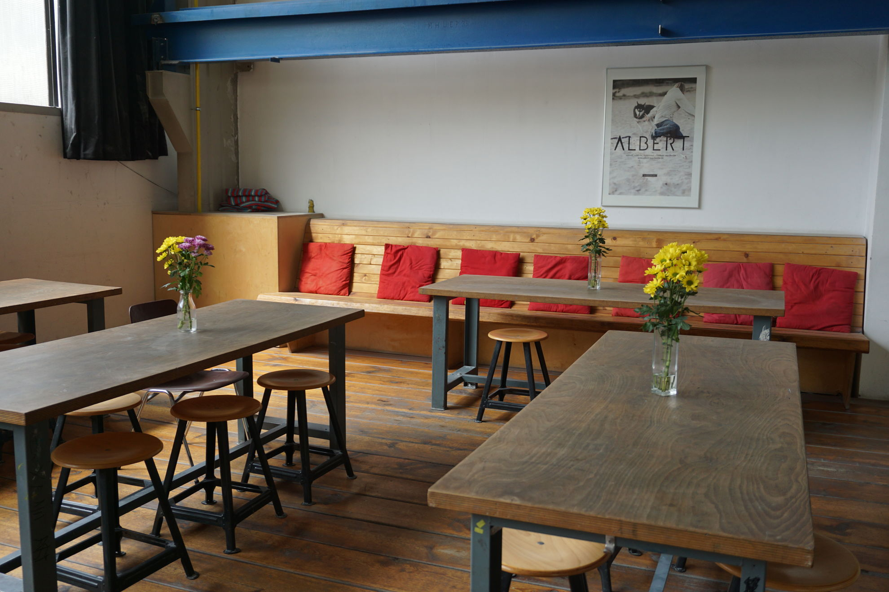

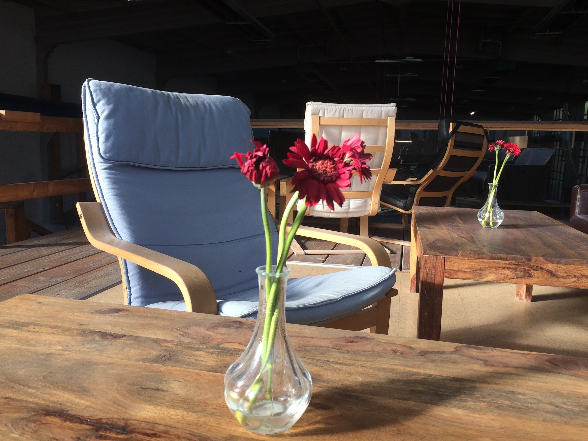

## Kids

In case you want to entertain your kids, you can definitely bring them to Berta Block! There is a children wall for small kids. Older kids can try some boulder problems in the first room. You should be aware that there is age limitation for 2nd (13+) and 3rd (16+) rooms.

Berta Block offers climbing courses and birthday parties for kids. Just contact them for more details.

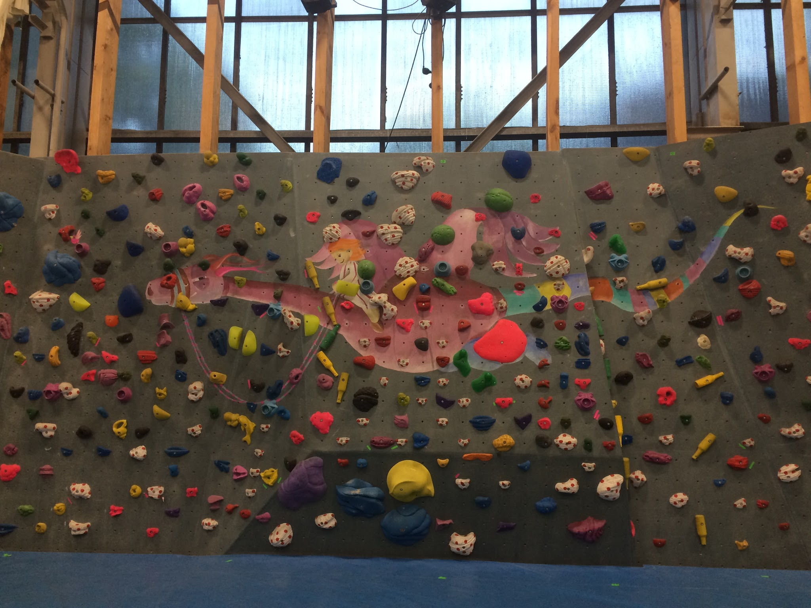

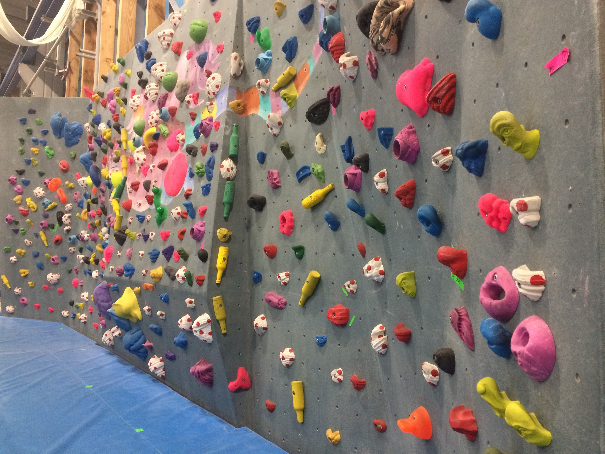

## Opening Hours

The gym is opened 7 days a week during the following hours:

- Monday: 11 — 23 Uhr
- Tuesday: 09 — 23 Uhr
- Wednesday: 09 — 23 Uhr
- Thursday: 11 — 23 Uhr
- Friday: 09 — 23 Uhr
- Saturday and Sunday: 10 — 23 Uhr

## Prices

Adult daily price is **10 eur**. It’s the highest price for a bouldering gym in Berlin. For students it will be 8 eur.

Berta Block also offers early bird option - Mo.-Fr. till 1 pm with the price 6 eur and they also have a variety of abonnements - 10, 20, 50 entries, half- or one-year membership cards. For more details please check the [official website](www.bertablock.de)

---

<iframe width="560" height="315" src="https://www.youtube.com/embed/WB0d1PowQXM" frameborder="0" allow="autoplay; encrypted-media" allowfullscreen></iframe>

Check out my YouTube channel for more climbing videos!
