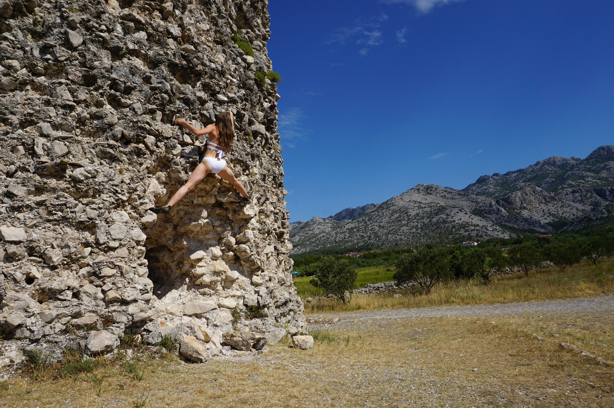

We spent last two weeks in **Croatia** - finally summer vacations! Not just vacations, but climbing vacations!!

Initially I did not think about writing and did not take a laptop, but I had a small notebook with me and started to write some notes every day, kind of a diary. It would be a pity to lose it, so I've decided to transform all my writings into a blog post together with pictures from vacations.

It is not intended to be a tourist guide, but you might find some useful information for travelling though. Keep reading if you are interested.

## July, 1st 

It's the third day of our holidays and I'm holding my small notebook and a pen in my hands for the first time. Me and Kris are in **Croatia**. Why Croatia? We have checked several destinations for active summer vacations. Our criteria was mostly mountains and sea, warm sea to be exact. :blush: Croatia fulfilled both of them.

We thought about this country separately and together - I've heard from my colleagues that it's a great climbing destination and promised my team lead (he is Croatian) to visit his country one day. And Kris planned a Balkan trip long time ago.

The decision was made when I got a Paklenica climbing guide book as a birthday present from Kris (it was last December). **Paklenica** is a great national park in Croatia. It is located in the region of northern Dalmatia. Having a book, we started to plan the rest. Actually it was not that much to plan - just choose dates and book plane tickets.

So half a year later, here we are, in Croatia. We are staying in **Starigrad**, a small town at the seaside. It's so calm and peaceful here! Many people are coming with families for camping. We are staying in an apartment which is located in 10 min from the sea, I love it!

Important to know that beaches are not sandy here, and we were not ready for it. Most of the people have special rubber shoes to walk on a beach and for swimming. Otherwise you can easily cut your foot. We must be careful...

Despite of that, it's very nice on local beaches! Sitting next to water with a soft evening breeze and the sound of the sea is very calming and relaxing. Yes that's our evening - chilling on the beach with a book. We both are not fans of crowded beaches when every 5 minutes someone is trying to sell you some sunglasses, blankets or other 'vacation crap'. Nothing like that here! Perfect!

Ok. Now to the main part of our vacations. Climbing. As I have already mentioned - we are staying next to the sea. But what a surprise - we need just 10 minutes (!) by car to get to the mountains! Amazing! It's a dream!

Some information about the park. Entrance is paid - it costs 50 Croatian kuna per person per day plus 10 kuna extra for parking. They also sell 5 days tickets for 150 kuna (about 20 euro) per person. We took those :wink:

The team keeps the park in a great condition. Everything is clean and organized.

You can find inside a gift shop with basic touristy stuff, snacks and climbing equipment. Next to the gift shop there is a mailbox (mum wait for a postcard from me!). There is a free, clean toilet, build into the mountain. And a bit later there is a cafe-bar with cold beeeeerrr.... It's definitely not a wild area :wink:

Now climbing walls. I called it an outdoor climbing gym. You can find a route for any age and taste! The most recommended ones are marked with metal labels. Sport routes have a fixed carabiner on the top, almost like in a gym - very practical! One disadvantage - many routes in the sport climbing section are very used and polished. I personally did not feel comfortable with my shoes slipping of an easy 4b-grade line. Otherwise, it's great! Routes are very well bolted, well, most of them. You can find all information in the guide book.

Our daily schedule is the following - wake up around 7 a.m. or so, I do my morning yoga (yes yes I've become one of the yoga addicts over last few months), we have a breakfast, drop our equipment to the car and go to the mountains. Around 9 a.m. we are already unpacking our rope and putting on harnesses.

It's getting crowded in the park after 9.30 a.m. - people occupying most of the sport walls, families, summer camp groups, couples as us, etc... So coming early (or in the late afternoon) is the key to find a good problem to work on.

We climb till we get tired, usually it happens after 2-3 p.m. Then we pack our gears back to the car and go home. There is not much to do in this town. We usually go to a beach in the evening or chill on our terrace. It's also getting warmer every day.

## July, 2nd

It's the 4th day of our vacations and the 3rd day of climbing. The day was quite intense.

First of all we trained for **multi-pitching**. We did not have any experience of doing multi-pitch routes besides theory and a couple of practices at home. Today we took one easy route (4b) to not be stressed about climbing and focus on the process. Kris led it, built an anchor and belayed me from top. After I climbed to the top, we simply abseiled/repelled down one after another. Sounds quite simple, definitely not a rocket science, but it took us some time - more than an hour I think.

Since it was our first real training we were slow, double checked everything and messed up a bit to be honest. But we did it! Which means, that we are ready for a real multi-pitch route! That's the plan for tomorrow. We are planning to take 2, maximum 3 pitches and train on them. The good thing is that the climbing region is huge and has plenty of routes, we already have a couple of them marked as a potential challenge.

Besides this training I sent two 5c routes today. I did them on-site what I did not expect from myself. I think my mental state is slowly changing in mountains, day after day. I do not have any fear to go up anymore. Only the reasonable one of course. I do not panic and keep on climbing. It's incredible to see these changes in my head! Kris said he noticed the same. Finally we can control our emotions and focus on climbing instead of fighting our fears!

That's our Sunday. Now it's about 6 p.m. and we found one more nice beach close to our house and enjoying evening sun here. Perfect place to put my thoughts together and take some notes..

## July, 3rd

*** 08:00 ***

Challenge of the day - multi-pitching. Challenge accepted! Let's go...

*** 20:00 ***

Well, we accepted the challenge but completely missed the goal..

The plan was to try one easy 2-pitches route. Multi-pitching routes are mainly located a bit deeper in the mountains. We stepped on the hiking path guided by our book. Estimated time to the desired wall was about 30 min walk. The way up was very steep and it was hard to go. After some time we realized that we missed the turn to our wall. Actually we did not notice any sign or turn on the way. We were already quite high in the mountains and had two options now - go down or actually slide down on this steep path or forget about multi-pitching and keep going up the mountain - the hiking path was still there.

One small addition - we had all our gears with us and the way up looked quite dangerous. From time to time there were even fixed ropes along the path - almost via ferrata.

We looked around the corner and thought that the top of the mountain is almost there. 'Let's keep on climbing up' we decided.

Oh, how wrong we were! The way up was long and dangerous. We had to change to our climbing shoes because our hiking sandals were not an option anymore.

We used fixed ropes a lot to pull ourselves up. We kept climbing up and up for about 2 hours (or 3?), I lost the idea of time.. But in the end we reached the summit of this mountain. The view was stunning! Mountains all around us.

 

After a short break we had to go down. But we REALLY did not have any wish to hike down on this steep mountain..

Then Kris saw some people on the next summit a bit further from us. Hope! If there are people - they must have hiked there somehow! Means we have a chance to have a better way down!

So we made a decision to keep walking on the ridge of the mountain to the next summit (still up). The path run along very sharp rocks with many huge gaps in between. We walked slowly until we made it to the summit. **Anica Kuk, 712m**. What? Only 700 meters? We had a feeling that we climbed Everest :sweat_smile:

Super exhausted we had to go down. The good thing was that Kris was right and it was a tourist hiking trail with no risky steps. At least no more challenges.

On the way down the mountain we looked like two zombies: tired, exhausted, no more talking, just kept walking... But we made it! Totally unexpected hike with all climbing gear on us.

Summary:

* Instead of climbing 2 pitches we did 7 hours of extreme hiking all along the ridge of Anica Kuk mountain.
* We used our climbing shoes for dangerous parts of the trail, otherwise we wouldn't go far in hiking sandals.
* Climbing gear was partially in use - we used harnesses and slings with carabiners for parts with fixed ropes.
* We made it to the top! Not multi-pitching and without using the rope.
* We reached to ridge of the mountain from one side, walked the whole way along it and came down from the other side of the mountain.
* You never know what mountains prepared for you. Be ready! 

## July, 4th

Not much to say today. We decided to go climbing in the afternoon and spent the first half of the day on the beach. I cannot really lay down for hours on the beach and do nothing, so I found an entertainment for myself. There is an old tower right on the beach which is perfect for a short climbing/traversing session. 

## July, 5th

Today we had a rest-from-climbing day. Five days of climbing in a row is enough!

After breakfast we jumped in a car and drove to **Split**, a city located on the south coast of the country. The way took us about 2 hours.

Split is very beautiful! It's an old Roman city, just imagine the city center - old ruins, nice small houses and narrow streets. Looks very similar to Italy. The best thing you can do in Split is to get lost in the labyrinth of its streets in the old town. There are hundreds of cafes and restaurants hidden around the corner.

Nevertheless we got tired of people quite fast :blush: and went to a beach. In the beginning we planned to go to a public beach Kasjuni Beach, but ended up on a wild cliff - perfect place to enjoy the sea and nature!

On the way home we visited a UNESCO protected city **Trogir**. Honestly I did not like it at all! It's full of people, on every corner, every step. The old town is like an ant-hill packed with tourists. 

 

Locals are trying to make money on it in all possible ways, even parking costs here 3 times more expensive than in Split - we paid 20 kuna for an hour. Super disappointed :disappointed:

## July, 7th

Today is a very important day for us - we did our first **multi-pitching** route! Yaaay! Not the route we planned from the beginning, but it does not matter. What does matter is the result. We did 2 pitches 80, 4b line and spent there about 3 hours.

What we definitely noticed is that multi-pitching lines are not so well-bolted as sport routes. Our line had 4-5 m distance between bolts. On the first glance it looked quite dangerous, but when I started to climb (I was leading) all fears disappeared and I was totally focused on climbing. In the end it was just 4b very positive line with many ledges and resting points. I guess a good experienced climber would laugh at us and would hardly call it an 'achievement'. But for us it definitely is! 

The key point was to train building anchors, belaying from top and managing the rope. I think we did everything very clean and without any mistakes.

The only thing where we failed - we did not use sun cream, because we came to the wall quite early and thought that we can finish it within one hour. As a result - 3 hours on the wall and a small sunburn.

I am super happy of the day! The goal of our vacations is achieved! We still have 2 more days of holidays, maybe we will try some challenging sport routes.

And one more thing. Kris was so happy after we finished the route! I haven't seen him so happy with such a big smile on his face for a long time! :heart: It makes this day even more special to me. I am proud of us!

## July, 8th

Today is a rest day and another city trip. This time we drove to **Zadar**. Both me and Kris like it the way more than Split. The cities are similar, very similar, but it was not so crowded in Zadar. Or maybe we just got lucky :wink:

Now we are sitting in one of coffee shops on the main square. It's late afternoon and we are tired of walking on the sun. It's a super hot day today, I guess now it's about +36C.  Kris is ~~falling asleep~~ reading a book :blush: and I'm just enjoying watching people passing by and drinking my cappuccino. I'm quite lazy to write to be honest..

But a bit about Zadar. It is a typical Mediterranean city to me with narrow streets, small buildings and smell of fish from each restaurant. In many souvenir shops you can find lavender gifts - dolls, small bags and pillows. There is something about this plant in Croatia..

## July, 10th

Vacations are over. It's time to go home. Everything as its end so is our trip to Croatia. But the memories will stay.

Backpacks are packed, we are sitting in the airport and waiting for boarding. I have some time to summarize last 12 days.

* First of all Croatia is a great place for summer vacations. It has sea, warm sun, mountains, nature, good food. For every taste.
* For active holidays it's better to go before July when the summer season starts. We have noticed that every days more and more people arrive, more people on the street, on the beach, in cities. Of course prices are raising in hot season as well. Plus the weather gets extremely hot (+36C is too much..)
* It's nice to explore Croatia by car. The main highway is paid but it's cheap and fast - totally worth it. 
* Prices are not cheap at all as we expected. The country is getting more and more touristic and locals are taking advantage of that. For example ironically but fish is the most expensive dish in every menu.
* There are queues to major touristic areas. If you want to avoid them, come everywhere very early at about 9 a.m. or late afternoon after 4 p.m.
* We spent the best time in Paklenica. Amazing nature, stunning views, great place for hiking and especially climbing. We did our first multi-pitching route! It opens new horizons in climbing to us! 
Camping is very popular here. Maybe next time :wink:
* We've learned that good shoes are very important. Even when you plan to hike for only 30 min it can end up with 6 hours of hiking. Don't underestimate nature, hiking sandals are not the best option.
* The Dalmatian coast is all covered with stones. To be comfortable on the beach you should have special rubber shoes. 
* Mosquitoes are very annoying in the night. Take a mosquito repellent with you.
* Local fruits and vegetables are very good. Don't buy them in supermarket, but check out local stands along the street instead.  It's cheap, fresh and tasty!
* German and Polish languages are the way more welcome than English.

We definitely enjoyed every single day and every moment of our trip! It's a beautiful country with amazing nature and I wish we had more time to explore it!

Check out a short movie, which we made during our vacations. Don't hestitate to leave a comment on youtube or drop me a message by email. I will be happy to hear your feedback about rock climbing in Croatia. Don't forgett to subscribe to my channel for more traveling and climbing videos. :clapper: :clapper:

`youtube: https://youtu.be/r-5-uX6-6Dg`

Save travel everyone :airplane: