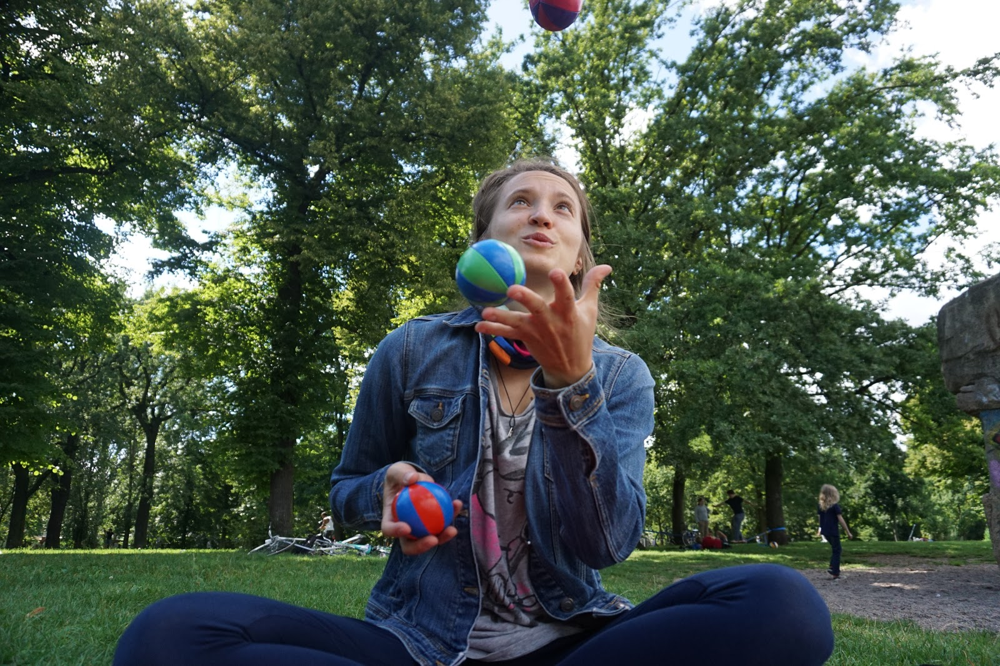
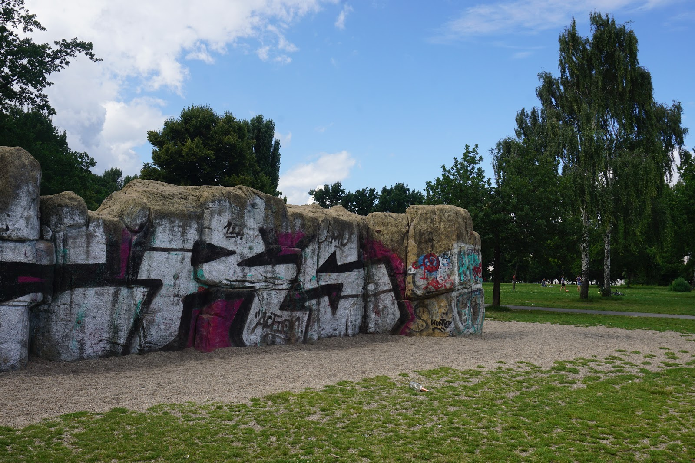
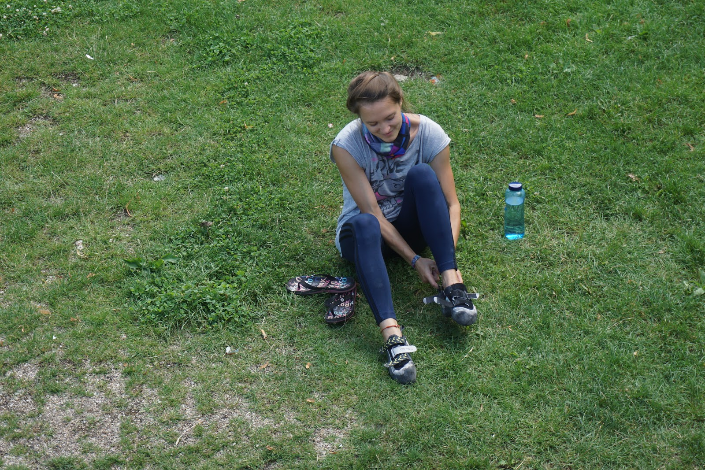
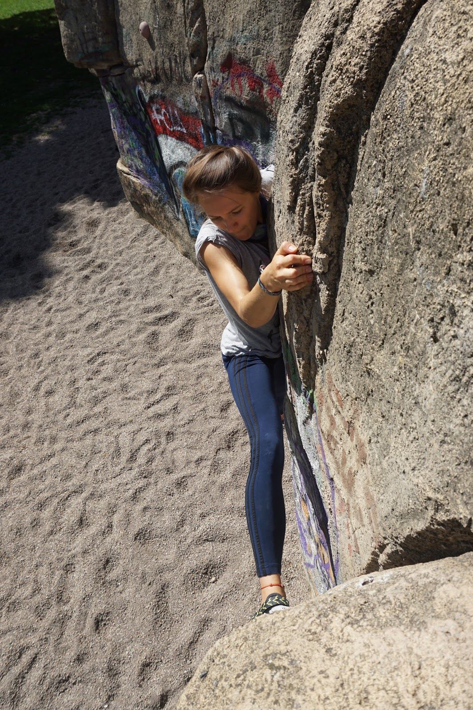
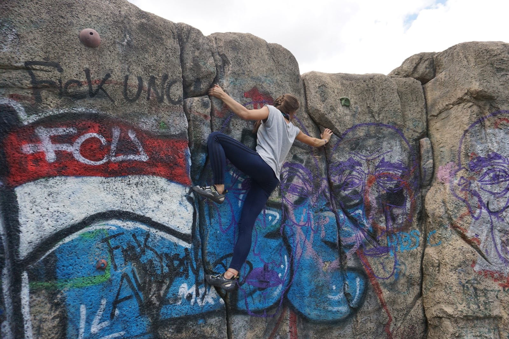
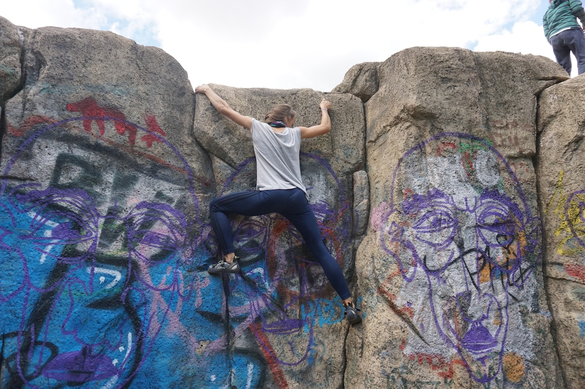

Usually on Sundays we go to a climbing gym. This time it was different - I felt sick. Nothing serious, but I was coughing the whole weekend and decided that it's not the best idea to run to a gym. Well, the day supposed to be quite lazy and relaxed..

In the afternoon we thought that it would be nice to get out of the apartment and have some fresh air in a park. We have a very nice park next to us - Volkspark Friedrichshain. It's one of the best parks in Berlin from my point of view! You can find people jogging, cycling, doing yoga, skating, playing frisbee, volleyball, grilling, etc. Really people do there all possible urban sport activities!

Of course I have a special point in my list of activities - rock climbing. And you might be surprised, but there is a nice artificial climbing rock in the park! Ta-da! It's more a traverse wall with many nice lines and interesting problems to solve. It's a great place to combine picnic with some bouldering!

Our plan was to chill, but we dropped our climbing shoes to the bike basket just in case and headed to the park. Of course after 10 minutes we were already changing shoes 🙂

I found a beautiful part for traversing, which starts in a small 'cave' if you can say so and goes the whole way around the wall. I have tried it already last year, but couldn't go so far. It was a pleasure to touch it again! I felt so much stronger than last year, it's an amazing feeling when you can easily do a move which you struggled with!

There are several ways people traverse the wall:

* you use the wall and all holds (there are some, but not many)
* you use the wall only
* you use the wall, but go low without using the upper part

I would say I am on the intermediate level and tried to use the wall only, but all parts of it. We recorded some of it, check it out:

<iframe width="560" height="315" src="https://www.youtube.com/embed/2wJCiDH7wac?rel=0" frameborder="0" allow="encrypted-media" allowfullscreen></iframe>

That was very nice Sunday! I am so happy that I can stay active and enjoy being outside even when not everything is according to the plan 😉
