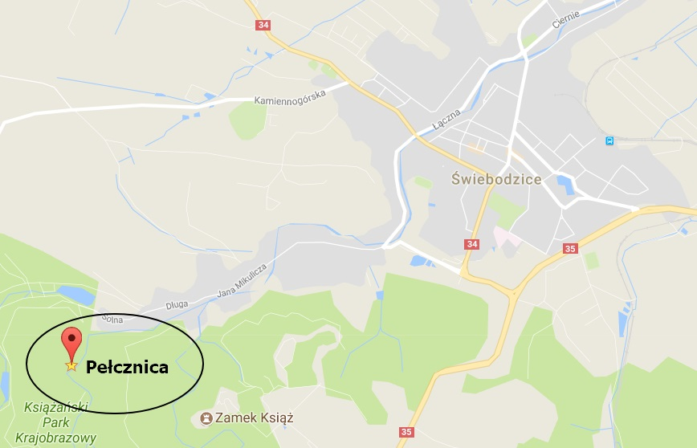

Autumn... I enjoy so much the beauty of nature this time of the year - falling leaves, golden forests and last warm days. But days are getting shorter and colder and it also means the end of outdoor climbing season.

Happily, we found a day, probably the last day this year, to go outdoors and do a bit of rock climbing. The place I want to show is **Pełcznica**. It is a very small crag in south-western Poland, close to a town **Świebodzice**.

_Coordinates: N 50° 50' 47.18'' , E 16° 16' 45.80''_

I believe you would never hear about this place if you don't know locals. The crag is located in the forest, it's very small and not visible from the road. Luckily Kris grew up in this region and showed me this lovely place.

I was truly impressed how many routes can be "packed" on one small wall - the total amount of lines according to the local topo is **42**! The height of the routes varies from 10 to 18 m. Here you can find detailed [topo](http://topo.portalgorski.pl/Pe%C5%82cznica,Pe%C5%82cznica,Pog%C3%B3rze-Sudeckie,Sudety,skala,752) and download it as pdf, just keep in mind that it's in Polish.

Most of the routes are marked directly on the wall together with their grades and variations. It is very practical!

All routes are well bolted. Not all bolts are new, but mostly in good conditions.

We sent a couple of nice routes and definitely planning to come back to work on harder ones! Here is a short video, which we recorded that day:

<iframe width="560" height="315" src="https://www.youtube.com/embed/KMI3booWzB0" frameborder="0" allow="autoplay; encrypted-media" allowfullscreen></iframe>

It's a great place whether you just happen to be there for a day or you want to work on a longer project!

If you are interested in this region and have any questions about Pełcznica, drop me an email. I will be happy to give an advice! Happy climbing!
