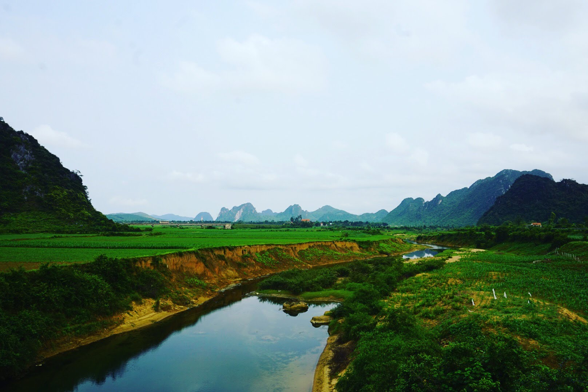
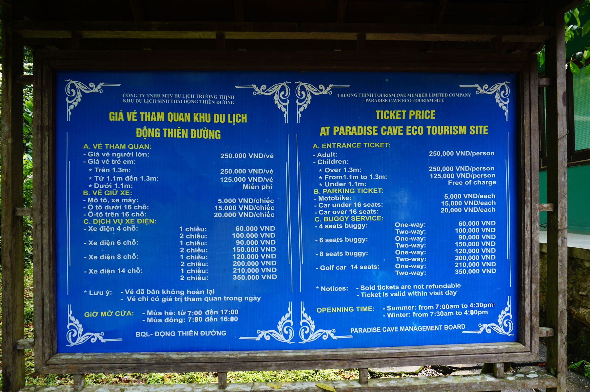
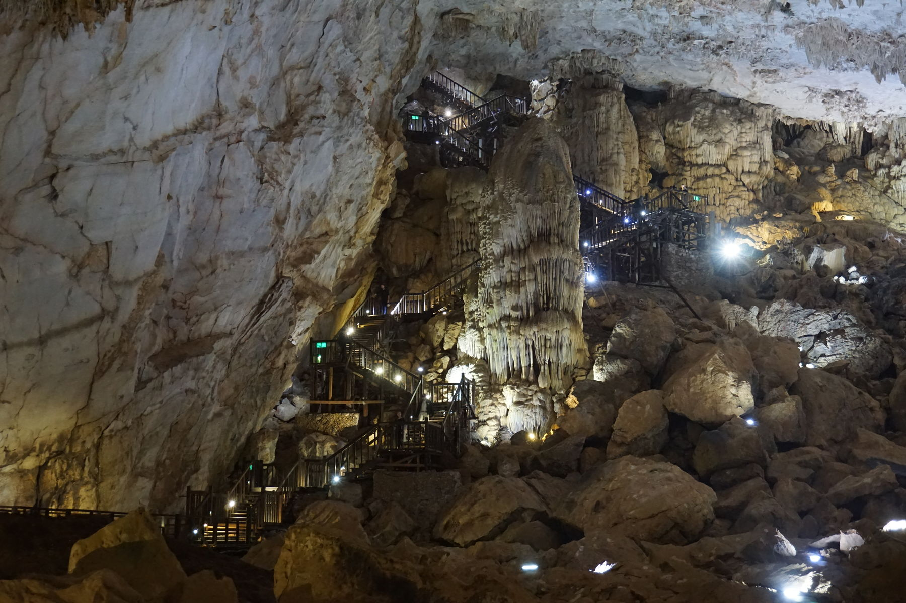
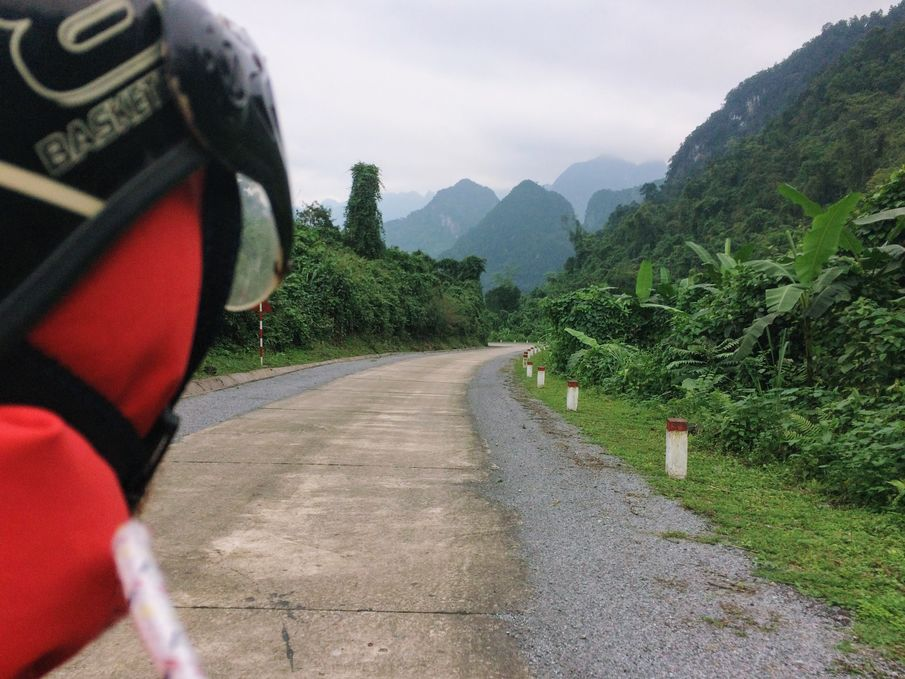

Phong Nha-Ke Bang National Park is an incredibly beautiful park in the Bố Trạch and Minh Hóa districts of central Quảng Bình Province of Vietnam. Many tourists come here every day to see the world's most fascinating caves. 

(!) Please note, that Phong Nha is an expensive area for tourists. Be ready to pay to enter every cave. And for some of them, you are even recommended to hire a guide. As we don't like guided tours, we visited Paradise Cave. And honestly - you must go there! This cave was far above my expectations - the most beautiful and spectacular stalactites and stalagmites I've seen in my life. 

Paradise cave was discovered by a local man in 2005 and the first 5 km of this cave was explored by explorers from British Cave Research Association in 2005, the whole 31 km was explored and publicly announced by the British cave explorers. This cave is 31 km long, longer than Phong Nha Cave which had been considered the longest cave in this national park. The height can reach to 72 m and 150 m wide. It's opened up to tourists only in 2010.

There are lots of things to do in Phong Nha national park besides caving. For example, you can visit the Botanic garden with a beautiful waterfall as we did. Or just driving around the park on a motorbike can be a good option too. Most of the homestays offer simple bicycles for free or to rent a motorbike for small money.

And if you are not lucky with the weather, go to Phong Nha Coffee Station (https://goo.gl/maps/u1bAMUEBpJv) - they make the best coffee in Vietnam. The barista is super nice and happy to explain how they make coffee and what is the difference between good and bad Vietnamese coffee :coffee::heart_eyes:

Check out the video we made during the trip and leave your comment there!

`youtube: https://youtu.be/u16ATPBzSRk`

Safe travel everyone :airplane: