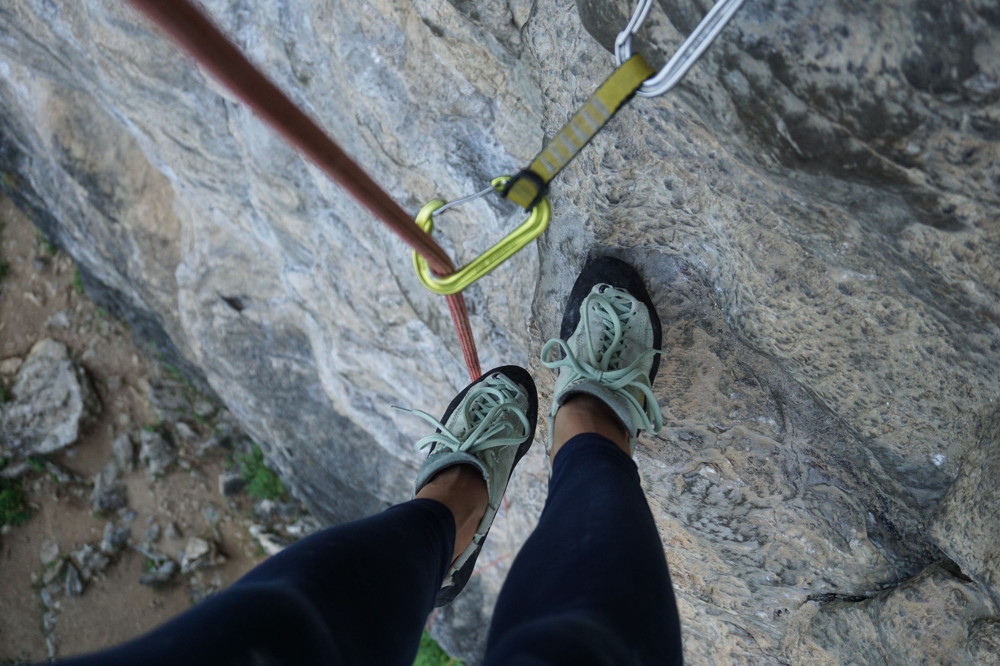
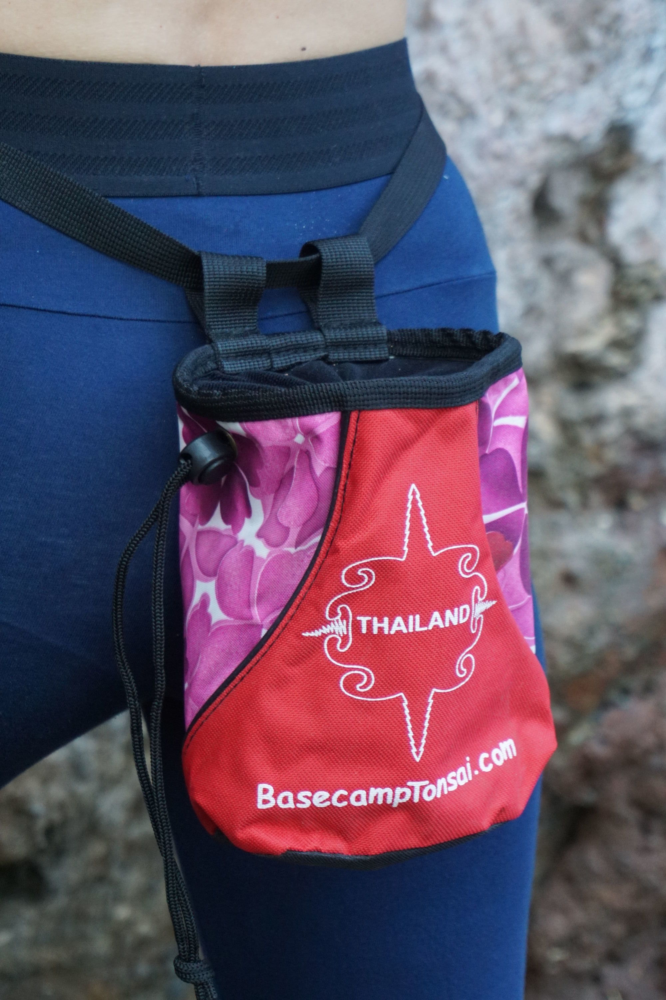

We reached Railay beach in the night. All exhausted from the road, we spent around two hours to find a bed to sleep and switched off, grateful to a nice local man for hosting us. The next day we woke up with the sun shining in our window and a breathtaking view on the cliffs! "Look where we are", Kris whispered to me. And he was right, we've reached Railay after 3 weeks of traveling!

Together with white sand beaches, stunning views and reggae vibes, the place offers great walls for climbers. If you have ever dreamed of climbing next to the sea, Railay and Tonsai beaches are definitely for you. You will challenge yourself with working on beautiful lines and enjoy watching other people climbing. And believe me, that's worth it! 

You might hesitate where to stay and/or climb, Railay or Tonsai beach. I understand this dilemma and would like to share our experience.

## Accommodations
**Railay** is a more touristic and commercial beach. It's more beautiful though and offers a better selection of accommodations together with restaurants, cafes and souvenir shops. 

**Tonsai beach** targets more backpackers and rock climbers. Most of the accommodations are simple bungalows. It will be easier to get a place to sleep in Tonsai, in case you haven't booked anything in advance. Just go to the **Tonsai Basecamp** and they will help you out with finding a place to sleep.

## Climbing walls
If we talk about climbing, you can climb on both. But...

Railay beach has several walls, which you can find in any local guide book. There are many simple routes, graded with 5 and even 4. It's a really good spot for beginner climbers. There is only one problem with Railay. Climbing schools. They arrive around 9-9.30 a.m. and occupy all the walls. Literally! Sometimes they come with a group of 10-15 people. At this moment, you can just pack your rope and go home. There will be not a single route to climb, unless you want to try something harder, starting with 6a-6b. On the other hand, climbing instructors are very friendly, relaxed and helpful people. They cheer up not only their students but also other climbers. We saw, how one instructor climbed a route the whole way up just to clean it because a climbing couple couldn't make it to the top. 

Our solution to "the climbing school problem" at Railay beach was to go climbing very early before 8 a.m. and climb a couple of routes, before schools arrived. Later on, when it was getting more crowded, we were moving to harder routes.

Tonsai beach is definitely a completely different story. First of all, the routes there are the way harder. The simplest line, which we found was 6a. Many people line up to climb it. There were no schools at Tonsai, we saw just once a guy with a private instructor. 

If you want to see how people are working on amazing insane routes, your destination point is Tonsai beach. There will be drive, there will be action at Tonsai beach!

In case you still hesitate where to stay and don't want to miss out any of the places, here is good news for you. These two beaches are connected with a small trail through the jungle. Which means, that regardless where you stay, all walls are reachable for climbing! You might need to wet your feet if you go during the day though. The water level is quite high at this time. Best time to pass the trail is early morning or late afternoon (after 6 p.m.). Also don't forget to take a headlamp or a flashlight with you, if you go in the evening. It gets dark super fast at the seaside.

## Bonus - my tips for renting climbing gear

    

If you come to Krabi for climbing like us, with only harnesses and shoes, I have a few tips for you about renting climbing equipment. We didn't bother to take heavy gears, as climbing was just a part of our travel. We rented a rope and quickdraws at the Tonsai basecamp. I would highly recommend you to do the same! Don't rent gears at Railay. There are many shops to rent, but it's totally overpriced! To compare: a climbing set, which includes a rope, 12 quickdraws, and a rope bag, costs 1000 Baht per day at Railay and at the Tonsai basecamp the price was 700 Baht. If you take equipment for several days, you might get lucky and get a discount. 

---------
That's all about our experience at Railay and Tonsai beaches. Have you been there and would like to share your experience? Don't hesitate and drop me a message per email or leave a comment to my youtube video!

Safe travel everyone! :airplane:

`youtube: https://youtu.be/7jJmIvxyJqo`

Our accommodation: [Rapala Bungalows](https://www.booking.com/hotel/th/rapala-rock-wood-resort-railay-krabi.en-gb.html), 600 Baht per night

Great coffee place: [Coffee Station Non's](https://goo.gl/maps/737r8LS3TQ62)